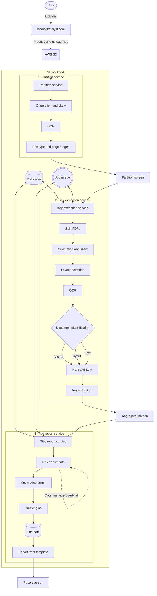
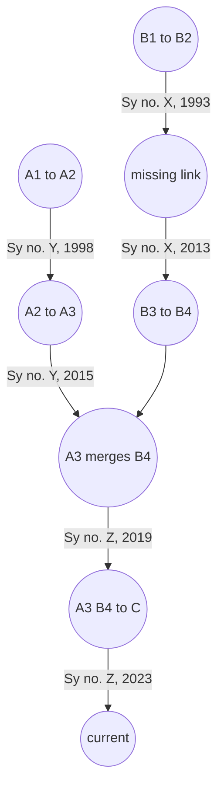

# Lending Katalyst -- my first startup reflections

Four years ago, straight out of college, I co-founded Lending Katalyst.[^lk] The job we cared about was property title search: who owned what, backed by a paper trail that lives in scans, not in a tidy API. The manual version was slow (on the order of four to ten working days per case), expensive, and full of human error as lawyers waded through hundreds to thousands of pages of multilingual real estate PDFs per matter.[^manual]

I told myself this was mostly an OCR problem. That was wrong, but it was a useful wrong thing to believe because it got me building.

I was the technical co-founder and, for most of the life of the company, the only full-time engineer. That meant I touched the models, the product, and the infra that had to survive real uploads at real deadlines.[^stack] In production we moved on the order of 150GB of PDFs, roughly 1.5 million pages across more than eight hundred Bengaluru projects.[^scale] The happy path we sold was real: that multi-day review loop could collapse to a couple of hours when the machine plus a human in the loop behaved. The product had teeth for buyers like SBI and Settlin. We still wound the company down when distribution and the business side of legal tech stopped lining up.[^shutdown]

This post is the technical post-mortem: computer vision, prompt caching, a title-chain graph, Celery workers, and the part no benchmark captures (what happens in a lawyer’s head when you “help” them).

## Contents

- [How to read this pipeline](#how-to-read-this-pipeline)
- [Architecture at a glance](#architecture-at-a-glance)
- [Phase 1: Ingestion and document boundaries](#phase-1-ingestion-and-document-boundaries)
- [Phase 2: LLMs, cache-shaped prompts, and fine-tuning](#phase-2-llms-cache-shaped-prompts-and-fine-tuning)
- [Phase 3: Title chain as a DAG](#phase-3-title-chain-as-a-dag)
- [Phase 4: Bursty load, queues, and memory routing](#phase-4-bursty-load-queues-and-memory-routing)
- [Phase 5: Psychology and over-building the UI](#phase-5-psychology-and-over-building-the-ui)
- [What I would carry into the next build](#what-i-would-carry-into-the-next-build)
- [References](#references)

## How to read this pipeline

One coarse picture of the system, left to right:

The sections below walk the same path in more detail.

## Architecture at a glance

The backend was deliberately boring in the good way: pieces talked over queues, work was chunked, and nothing assumed a single long HTTP request could finish the job.[^async]

*Figure: internal flow from upload through the three big services to the screens where humans corrected the machine.*

> **Figure 1:** System overview for slides or social  
> *Screenshot to add: one slide or diagram that matches the flow above (product screenshot, simple boxes, or infra sketch). Helps readers who do not want to parse Mermaid on a phone.*  
>
>
>
>

## Phase 1: Ingestion and document boundaries

If you have shipped anything against “enterprise” uploads, you already know the input is not a JSON POST. Lawyers scanned pages on phones. We got folders of `untitled_1.jpg` and friends.

The first service was a stitching Lambda: watch S3, reject passworded or broken files, sort images by the naming patterns phones use, merge into one PDF per upload batch.

A clean PDF still was not a clean problem. Thirty pages in one file could be three deeds stacked back to back. That is the document boundary problem.

We built a partition service and treated it as vision first, not “OCR everything and hope.” Orientation and skew went through a small CNN. Layout used YOLOv5 and Paddle layout to put boxes on headers and titles. We OCR’d only those crops. When OCR said something like “SaI Deed,” a domain matcher snapped it toward “Sale Deed” and marked a plausible start page for a new document span.

Models miss. We leaned into human-in-the-loop: a partition screen with a split-by-page grid so a user could correct ranges in seconds instead of re-reading the whole stack.

> **Figure 2:** From chaos to boundaries  
> *Screenshot to add: left, messy mobile scans or file list; right, partition grid with ranges (blur case IDs).*  
>
>

## Phase 2: LLMs, cache-shaped prompts, and fine-tuning

Partitioning bought us spans. The next job was structured key-value extraction.

Before the API LLM era, that stack was NER plus rules in English and Kannada, and it broke whenever reality broke. In 2023 we rebuilt on Gemini-class models because one call could carry OCR, translation, and layout signal together.

The annoying part is cost. Full prompts on fat legal PDFs eat tokens the way heavy inference eats VRAM.

We structured prompts for provider-side caching: one huge, stable system block (instructions, schemas, few-shots) and the variable document chunk always appended last so the prefix stayed cache-hot. Same idea as keeping weights static and only feeding new activations. In our measurements that discipline cut fresh input tokens to mostly the document body and pulled API cost down on the order of 70% to 85% with better latency to match.

The segregator UI turned corrections into data. We took a tight validation set (on the order of three hundred hard, user-corrected documents) and ran supervised fine-tuning on the vision model so extractions and page pointers stopped being “almost right” on the documents we saw every week.

> **Figure 3:** Human corrections as training signal  
> *Screenshot to add: segregator with one corrected field visible; optional side note on token or cost before and after caching (numbers redacted OK).*  
>
>

## Phase 3: Title chain as a DAG

A folder of JSON extracts is not a title opinion. You need a chain of ownership that holds across decades. We linked documents into a directed acyclic graph on entities (names, dates, property identifiers).

*Figure: simplified title graph. The `missing link` node is where IDs almost line up but people or spans do not, so the rule engine stops and flags.*

Entity resolution was the unglamorous core: deterministic fuzzy matching down to atomic strings, initials versus full names (“Sri. K Surya” versus “Mr. Koidala Surya Prakash”), survey numbers with different prefixes (“Survey no 23” versus “Sy. 23”). Once nodes lined up, the rule engine walked subgraphs, flagged gaps like the node above, ran the deterministic legal checks we could encode, and emitted the Word report from a template.

> **Figure 4:** Graph or rule output  
> *Screenshot to add: anonymized subgraph, rule-engine flag, or “missing link” UX (no real party names).*  
>
>

## Phase 4: Bursty load, queues, and memory routing

Workload shape matters. A lawyer drops a zip of dozens of files at 4pm and wants progress, not a 504.

I split the ML backend into Celery with RabbitMQ on Kubernetes: manager workers chopped a job into per-document tasks; tasker workers pulled from the queue. Autoscaling watched queue depth (roughly, pending tasks scaled against a divisor on tasker count) so burst turned into parallel workers instead of one giant process.

OCR and vision are RAM-shaped. Early on, big PDFs OOM-killed workers. Rather than rewriting the world, the manager tagged tasks by page count: over fifty pages went to high-memory taskers (8GB), smaller docs to mid-memory (4GB).

Rate limits were the other wall. Fifty hot workers hammering one region’s API endpoint buys 429s. We used concurrent async calls, exponential backoff, and spread traffic across regions where the provider allowed it, with a thin observability layer so we could see who was starving.

> **Figure 5:** Queues or scale  
> *Screenshot to add: queue depth, worker counts, or a Grafana-style panel (blur account details).*  
>
>

## Phase 5: Psychology and over-building the UI

At some point the limit was not FLOPs. It was ego and attention.

We automated the reading and synthesis a lawyer was trained to own. The product turned them into an editor of machine output. For many people, checking someone else’s draft costs more mental energy than drafting from a blank page, even when the draft is mostly right.

My engineering reflex was wrong: I added panels, toggles, and modes. The surface area grew. Usage did not follow. Extra chrome stole context and increased cognitive load without speeding the core loop.

Today I would still use humans where the law requires judgment. I would not stop at “model writes, human edits.” I would spend compute on verifier passes, critic models, and tight loops that burn tokens on the builder side so the human sees a short, high-confidence diff instead of a wall of suggestions. The scarce resource is attention, not a few more dollars of inference.

> **Figure 6:** Optional UI complexity  
> *Screenshot to add: busy settings or unused panels if you still have them; illustrates the over-build story. Skip if nothing safe to share.*  
>
>

## What I would carry into the next build

Legal work here was a special case of a general pattern: highly documented knowledge work with formal structure, like code with citations. Four things I believe more strongly after shipping this:

**Ship sooner than feels comfortable.** You can almost always get a narrow vertical slice in front of users faster than your architecture slides say. Perfection is a postponement strategy.

**Fewer features, harder guarantees.** Count features like they cost you support hours, because they do. Make the minimum set boringly reliable.

**Spend inference to save attention.** If you are selling completed work, buy the tokens, run the second model, do the critic loop. API spend is usually cheap compared to burned human focus.

**Assume inference gets cheaper.** Do not freeze a pipeline around today’s price per million tokens if you can help it. Design so you can widen context, add verification, or swap models when the curve moves.

Grateful to the customers who trusted us, to the people who funded the attempt, and to my co-founders. On to the next thing.

## References

[^lk]: Lending Katalyst: company context and problem framing as described in this post.

[^manual]: Manual effort and timeline (four to ten working days; hundreds to thousands of pages per case) as observed in the title-search workflow we targeted.

[^stack]: Role and scope: technical co-founder, sole full-time engineer, end-to-end ownership of ML, product architecture, and scaling.

[^scale]: Production volume: on the order of 150GB PDFs, ~1.5M pages, 800+ Bengaluru projects (approximate totals as tracked internally).

[^shutdown]: Wind-down driven by business and distribution constraints in legal tech; product performed for named customers but scaling the company did not work.

[^async]: Async, decoupled producer-consumer design to handle bursty document processing.