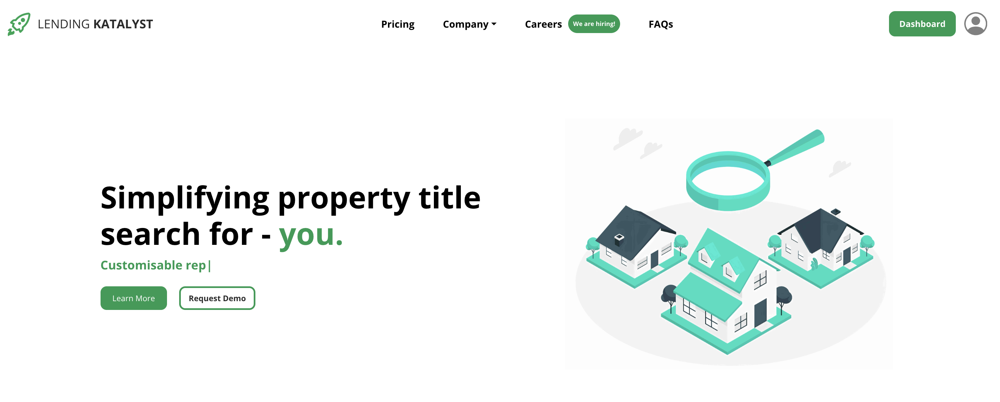
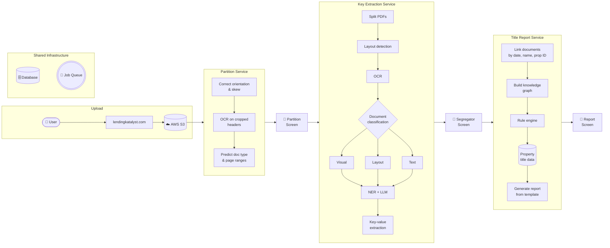
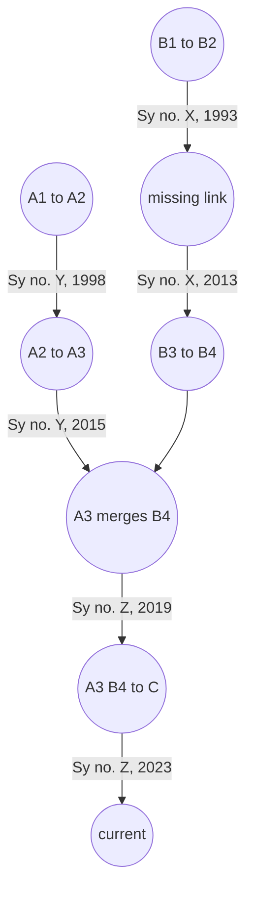
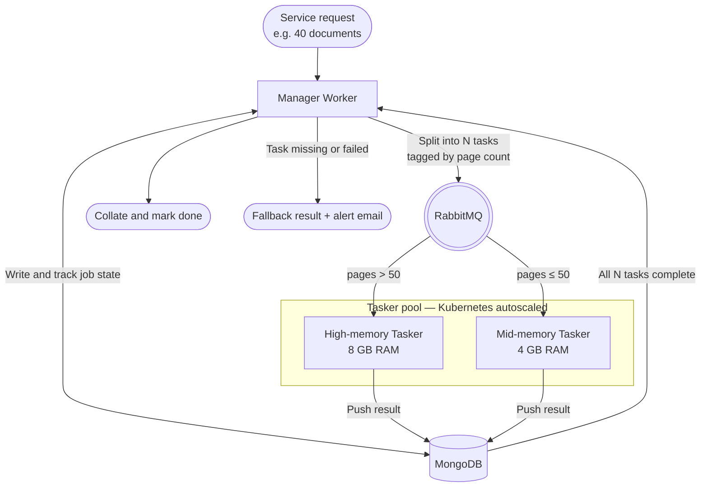

# Lending Katalyst -- my first startup & reflections..

<!-- [Landing: product entry point for lawyers and ops teams](assets/landing.png) -->

**Contents:** [Pipeline](#the-pipeline-left-to-right) · [Architecture](#system-architecture) · [Ingestion & boundaries](#making-sense-of-chaos-ingestion-and-document-boundaries) · [Extraction evolution](#from-ner-to-vision-llms-how-the-extraction-stack-evolved) · [Title chain](#turning-extracted-facts-into-a-legal-proof-the-title-chain) · [Distributed backend](#when-40-files-arrive-at-4pm-the-distributed-backend) · [UI trap](#the-ui-trap-more-surface-area-less-use) · [Lessons](#four-things-i-now-believe-more-strongly) · [References](#references)

Four years ago, straight out of college, I co-founded Lending Katalyst, an AI copilot for property lawyers.[^lk](lendingkatalyst.com) The job we cared about was property title search: legal due diligence to verify that the property you are buying has a clean title, free of liens, disputes, and encumbrances. The manual version was slow (four to ten working days per case), expensive, and full of human error as lawyers waded through hundreds to thousands of pages of multilingual real estate PDFs per matter.[^manual]

When we started, I told myself this was just an OCR problem. Boy, was I so wrong. That naivety got me moving and tackling we dug deeper solving one problem after the other, building  feature after feature and time just flew. It reminds me of Jensen Huang’s comment: if you knew what it really took to build Nvidia, he’d never dared to get started.

I was the technical co-founder and, for most of the company's life, the only full-time engineer. That meant owning the models, the product, and the infra.[^stack] In recent years we moved roughly 150GB of PDFs, about 1.5M pages across more than 800+ Bengaluru projects, serving everyone from 2 BHK buyers to developers moving a thousand flats, villa owners, proptech companies, and SBI, India's largest bank.[^scale] The happy path we sold was real: that multi-day review loop could collapse to a few hours when the machine and a human in the loop both behaved.

We started as a AI legal SaaS [probably one of the earliest in India to do so when there was no utter of the GenAI word], billing individual lawyers monthly (the classic dream), which never quite landed , then changed to selling to legal teams in prop techs . When LLMs arrived we pivoted toward Outcomes-as-a-Service, stood up an in-house legal team, and the work got meaningfully better. But we could never close the operational gap to reach real startup scale, and we burned out trying. We wound the company down when distribution and the business side of legal tech stopped lining up.[^shutdown]

Building this with my cofounder was the most exhilarating, fulfilling thing I have ever done in my life till date. We moved like yin and yang, counterbalancing each other's strengths and blind spots with an ease you cannot plan for and holding together through the ebbs and flows. That brotherhood is the part I will miss the most moving on. 

## The pipeline, left to right

One coarse picture of the system, left to right:

The sections below walk the same path in more detail.

## System architecture

The backend was deliberately boring in the good way: pieces talked over queues, work was chunked, and nothing assumed a single long HTTP request could finish the job.[^async]

*Three services, three HITL checkpoints, one report. The extraction service shown here reflects the earlier NER + rule-based pipeline; as described below, that layer evolved through several generations to end up as a vision LLM with supervised fine-tuning.* 

---

## Making sense of uploaded chaos: ingestion and document boundaries

If you have shipped anything against "enterprise" uploads, you already know the input is not a JSON POST. Lawyers scanned pages on phones. We got folders of `untitled_1.jpg` and friends. We receive pdfs, jpgs, pngs, tiff [yeah larger pixelated files that contained scans of building plans]

The first piece was a stitching Lambda: watch S3, reject passworded or broken files, sort images by the naming patterns phones produce (more predictable than you would expect), and merge everything into one PDF per upload batch.

A clean PDF is not a clean problem. Thirty pages in one file could be three deeds stacked back to back. That is the document boundary problem, and it is the kind of thing that looks trivial until you have stared at a few hundred examples.

We treated partitioning as a vision problem, not "OCR everything and hope." A small CNN handled orientation and skew correction to normalize tilted scans. YOLOv5 and Paddle Layout Parser drew bounding boxes on structural artifacts: headers, seals, stamped titles. We OCR'd only those crops, not the full page. When a crop came back as "SaI Deed," a domain matcher snapped it to "Sale Deed" and marked a plausible page boundary for a new document span.

Models miss. We leaned into human-in-the-loop: a partition screen with a split-by-page grid let a user correct ranges in seconds instead of re-reading the whole stack.

[Partition: pages grouped by document type; color-coded boundaries](assets/partition.png)

---

## From NER to vision LLMs: how the extraction stack evolved

Partitioning bought us document spans. The next job was extracting structured key-value pairs from each one, and that problem turned out to be a live view of how the whole field was changing underneath us.

We started pre-LLM: OCR text through a NER model, then rule-based stitching to assemble labeled spans into JSON. For a Party Information field in a Sale Deed, NER would tag spans like `[Surya : VNM] [aged 20 : TAG] [care of : TCO] [Mr. Sudarsan : VNM]` and a rule layer would walk the sequence and build the output. My cofounder annotated in 1000s of samples in Label Studio [man cant beat that guy on patience]; I finetuned YOLO, BERT variants on it. Roughly forty document types, a mix of structured, semi-structured, and unstructured layouts, and a feedback loop slow enough that adding a new document type felt like a project. For Kannada we trained a multilingual BERT and evaluated with some custom built metrics on top of nervaluate[^nervaluate] rather than flat token-level F1, which masks partial-match failures. Still fragile.

When early LLMs became available over API, it was obvious the rule-based downstream was not worth keeping. But context windows were small, so we kept OCR and used NER as a retrieval layer [yeah a different form of RAG even before the term went viral]: identify the key text regions, cut those spans, feed the condensed text to the LLM. We also built our own fault-tolerant JSON parser because structured outputs did not exist yet and the models returned near-JSON with regularity.

As context windows widened, we dropped the NER pre-selection and sent much more text directly. Then structured output APIs arrived and the parser vanished. Then vision came to the models and we started feeding page images directly, skipping OCR entirely for the documents where visual layout carried information that text alone lost.

In a way, it was just me turning into a twitter freak to keep up with all the latest releases and shipping things asap.

We closed the loop with supervised fine-tuning on Gemini using roughly 300 hard, user-corrected documents from the segregator UI. Fine-tuned models predicted extracted values and exact page numbers; accuracy for the most frequent document types converged around 95%. For few-shot examples in the system prompt we applied prefix caching: one large, stable system block with instructions, schemas, and examples, variable document chunk appended last. The prefix stayed cache-hot across requests. Same idea as keeping weights static and only feeding new activations. API cost dropped 70 to 85 percent with better latency to match.

The clearest measure of the shift: shipping support for a new document type went from roughly twelve months of annotation and retraining to roughly one month, mostly spent on evals. The bottleneck moved from labeling pipelines to evaluation quality, and that changes how you build.

[Segregator: PDF and extracted fields side by side; corrections fed SFT](assets/segregator.png)

---

## Turning extracted facts into a legal proof: the title chain

A folder of JSON extracts is not a title opinion. You need a chain of ownership that holds across decades. We modeled the full ownership history as a DAG [directed acyclic graph]: each node a document, each edge a legal transfer of rights between parties.

*The `missing link` node is where IDs almost line up but parties or spans do not. The rule engine stops here and flags it.*

Entity resolution was the unglamorous core. Real estate records are historically inconsistent: "Sri. K Surya" and "Mr. Koidala Surya Prakash" are the same person; "Survey no 23" and "Sy. 23" are the same plot. We built deterministic fuzzy-matching down to atomic string components, with initial-expansion logic for names and prefix-stripping for property identifiers.

Once nodes resolved, the rule engine walked subgraphs, flagged gaps like the one above, ran the deterministic legal checks we could encode, and emitted a drafted Word document from a bank-specific template. The lawyer's job shifted from writer to final editor.

[Title chain graph: transactions, merges, search across parties](assets/title-chain.png)

[Report: bank-formatted table by survey number and parties](assets/report.png)

---

## When 200 files arrive at 4pm: the distributed backend

Workload shape matters. A lawyer is quiet for two days, then drops a zip of 200 files at 4pm and wants progress, not a 504.

The ML backend was split into two Docker images: a manager image and a tasker image. Three services ran on this split: partition, key extraction, and report generation. Every service request followed the same contract: a manager picked it up, broke it into per-document tasks, and handed off to the queue.

Here is what a 200-document extraction job looked like in practice. The manager received the request, created forty isolated tasks, pushed them onto a RabbitMQ queue, and wrote initial state to MongoDB. Then it sat idle. Tasker workers pulled from the queue and did the heavy work: read the PDF, run OCR, call the LLM, write the result back to MongoDB. When all forty tasks completed, the manager woke up, pulled results from MongoDB, collated them, and updated the job status for the frontend. If a task failed or timed out, the manager caught the gap on wakeup, fell back to a default result for that document, and fired an alert email. Nothing was silently dropped.

OCR and vision are RAM-shaped, and our code was not optimized to batch memory efficiently. Throwing a large legal deed at a standard container would fill RAM, and the container would get OOM-killed mid-process with no output and no obvious error. Rather than rewriting the memory management, I solved it at the infrastructure layer. Before placing a task in the queue, the manager checked the document's page count. Over fifty pages got tagged for high-memory taskers (8GB). Everything else went to mid-memory taskers (4GB). This kept throughput high without over-provisioning the whole cluster with expensive instances.

Rate limits were the other wall. Fifty hot taskers hammering one provider region buys 429s. We spread requests across geographic regions where the provider permitted it, used concurrent async calls with exponential backoff, and added a thin observability layer so we could see which workers were starving and act before the queue backed up.

---

## The UI trap: more surface area, less use

At some point the limit was not accuracy of the product. It was lack of empathy to users. I was too much occupied with shipping more features that would increase productivity of a pro user, without really nailing the core ones which were stil breaking at times. I should admit that was on me. 

> -- A rule of thumb to my future self
>
> "If you're the engineer designing the UX and it feels obvious to you, make it five times simpler before shipping it to your audience."  

We had automated the core reading and synthesis work a lawyer was trained to own. The product turned them into editors of machine output. For many people, reviewing someone else's draft costs more mental energy than starting from a blank page, even when the draft is mostly right. This is not a complaint about lawyers; it is just how cognition works when you lose authorship of the first pass.

My engineering reflex made it worse. I added panels, toggles, and modes. The surface area grew. Usage did not follow. Extra chrome stole context without speeding the core loop.

The right answer is not "model writes, human edits." It is: burn compute on the builder side so the human sees a short, high-confidence diff instead of a wall of output to review. Verifier passes, critic models, tight internal loops. The scarce resource is attention, not inference spend.

---

## Four things I now believe more strongly

Legal title search was a special case of a general pattern: highly documented knowledge work with formal structure, like code with citations. Four things I believe more strongly after shipping this:

- **Ship sooner than feels comfortable .** You can almost always get a narrow vertical slice in front of users faster than your architecture slides say. Perfection is a postponement strategy.
- **Fewer features, harder guarantees.** Count features like they cost you support hours, because they do. Make the minimum set boringly reliable.
- **Spend inference to save attention.** If you are selling outcomes [completed work], buy the tokens, run the second model, do the critic loop. API spend is usually cheap compared to burned human focus and the attention that gets attritioned.
- **BE MORE BRAVE, BRAVER THAN YOU THINK YOU ARE OR YOU CAN BE WITH EVERYTHING**

Grateful to our customers, team, investors and my cofounder. Could never make this far without them.

---

## References

[^manual]: Manual effort and timeline (four to ten working days; hundreds to thousands of pages per case) as observed in the title-search workflow we targeted.

[^stack]: Role and scope: technical co-founder, sole full-time engineer, end-to-end ownership of ML, product architecture, and scaling.

[^scale]: Production volume: on the order of 150GB PDFs, ~1.5M pages, 800+ Bengaluru projects (approximate totals as tracked internally).

[^shutdown]: Wind-down driven by business and distribution constraints in legal tech; product performed for named customers but scaling the company did not work.

[^async]: Async, decoupled producer-consumer design to handle bursty document processing.

[^nervaluate]: nervaluate by MantisAI: span-level NER evaluation with support for partial and overlapping entity matches. [https://github.com/MantisAI/nervaluate](https://github.com/MantisAI/nervaluate)